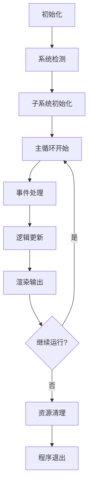

# SceneWeaver 技术栈文档

## 📋 项目概述

SceneWeaver是一个基于Python的端侧实时混合现实创作系统，专为高通骁龙X Elite平台优化设计。本文档详细说明项目的技术选型、架构设计和各组件的技术细节。

## 🏗️ 整体架构设计

### 系统架构图

```
┌─────────────────────────────────────────────────────────────┐
│                    应用层 (Application Layer)                 │
│  ┌─────────────┐  ┌─────────────┐  ┌─────────────┐          │
│  │   主程序    │  │  配置管理   │  │   日志系统   │          │
│  │  main.py    │  │ ConfigMgr   │  │   Logger    │          │
│  └─────────────┘  └─────────────┘  └─────────────┘          │
└─────────────────────────────────────────────────────────────┘
                                │
┌─────────────────────────────────────────────────────────────┐
│                    引擎层 (Engine Layer)                      │
│  ┌─────────────┐  ┌─────────────┐  ┌─────────────┐          │
│  │  核心引擎   │  │  场景管理   │  │  资源管理   │          │
│  │ CoreEngine  │  │SceneManager │  │ResourceManager│         │
│  └─────────────┘  └─────────────┘  └─────────────┘          │
└─────────────────────────────────────────────────────────────┘
                                │
┌─────────────────────────────────────────────────────────────┐
│                   子系统层 (Subsystem Layer)                  │
│  ┌─────────────┐  ┌─────────────┐  ┌─────────────┐          │
│  │ 图形系统    │  │   AI系统    │  │ 输入系统    │          │
│  │  Renderer   │  │  AISystem   │  │InputHandler │          │
│  └─────────────┘  └─────────────┘  └─────────────┘          │
│                                                              │
│  ┌─────────────┐  ┌─────────────┐  ┌─────────────┐          │
│  │ 音频系统    │  │ 网络系统    │  │ 工具系统    │          │
│  │AudioSystem  │  │NetworkSystem│  │   Utils     │          │
│  └─────────────┘  └─────────────┘  └─────────────┘          │
└─────────────────────────────────────────────────────────────┘
                                │
┌─────────────────────────────────────────────────────────────┐
│                    平台层 (Platform Layer)                     │
│  ┌─────────────┐  ┌─────────────┐  ┌─────────────┐          │
│  │  Pygame API │  │  AI框架     │  │ Python标准库 │          │
│  │ (2D/3D渲染) │  │ TF/PyTorch  │  │   Std Lib   │          │
│  └─────────────┘  └─────────────┘  └─────────────┘          │
└─────────────────────────────────────────────────────────────┘
```

## 🔧 核心技术组件

### 1. 编程语言与运行时

#### Python 3.12
- **版本**: Python 3.12.10
- **优势**: 
  - 性能优化显著提升
  - 更好的类型提示支持
  - 内存管理改进
  - ARM64架构优化

#### 运行时环境
```python
# 系统信息
操作系统: Windows 11 (ARM64)
Python实现: CPython
编译器: MSC v.1943 64 bit (AMD64)
```

### 2. 图形渲染系统

#### Pygame 2.6.1
**选择理由**: 替代OpenGL解决ARM64兼容性问题

```python
# 核心特性
import pygame
from pygame.locals import *

class PygameRenderer:
    def __init__(self):
        self.screen = None
        self.clock = None
    
    def initialize(self):
        pygame.init()
        self.screen = pygame.display.set_mode((1280, 720))
        self.clock = pygame.time.Clock()
```

**技术优势**:
- ✅ 跨平台兼容性极佳
- ✅ ARM64环境下稳定运行
- ✅ 丰富的内置功能
- ✅ 简单易学的API
- ✅ 活跃的社区支持

#### 渲染管线设计
```
输入数据 → 顶点处理 → 光栅化 → 像素着色 → 输出显示
    ↓         ↓         ↓         ↓         ↓
场景图    变换矩阵    扫描转换    着色计算    帧缓冲
```

### 3. AI推理框架

#### 双框架支持策略

##### TensorFlow 2.20.0
```python
import tensorflow as tf

class TFAIEngine:
    def __init__(self):
        # 设备检测
        if tf.config.list_physical_devices('GPU'):
            self.device = '/GPU:0'
        else:
            self.device = '/CPU:0'
    
    def load_model(self, model_path):
        with tf.device(self.device):
            self.model = tf.keras.models.load_model(model_path)
```

##### PyTorch 2.4.1
```python
import torch
import torch.nn as nn

class TorchAIEngine:
    def __init__(self):
        # 设备自动检测
        self.device = torch.device(
            'cuda' if torch.cuda.is_available() 
            else 'cpu'
        )
    
    def load_model(self, model_path):
        self.model = torch.load(model_path, map_location=self.device)
        self.model.eval()
```

#### 设备优化策略
```python
class DeviceOptimizer:
    def detect_optimal_device(self):
        """智能设备检测"""
        priority_order = ['NPU', 'GPU', 'CPU']
        
        # 检测NPU支持
        if self._has_npu_support():
            return 'NPU'
        # 检测GPU支持  
        elif self._has_gpu_support():
            return 'GPU'
        else:
            return 'CPU'
```

### 4. 配置管理系统

#### PyYAML 6.0.3
```yaml
# config.yaml 示例配置
graphics:
  width: 1280
  height: 720
  fullscreen: false
  vsync: true
  antialiasing: 4

ai:
  device: "auto"
  model_path: "./models"
  batch_size: 8
  precision: "fp16"

input:
  mouse_sensitivity: 0.1
  movement_speed: 2.5
  gesture_threshold: 0.8

performance:
  target_fps: 60
  max_memory_mb: 2048
  enable_profiling: false
```

#### 配置管理器实现
```python
import yaml
from typing import Any, Dict, Union

class ConfigManager:
    def __init__(self, config_file: str):
        self.config_file = config_file
        self.config = self._load_config()
    
    def _load_config(self) -> Dict[str, Any]:
        """加载配置文件"""
        try:
            with open(self.config_file, 'r', encoding='utf-8') as f:
                return yaml.safe_load(f)
        except FileNotFoundError:
            return self._create_default_config()
    
    def get(self, key_path: str, default: Any = None) -> Any:
        """获取配置值，支持点分隔路径"""
        keys = key_path.split('.')
        value = self.config
        
        try:
            for key in keys:
                value = value[key]
            return value
        except (KeyError, TypeError):
            return default
```

### 5. 性能监控系统

#### psutil 7.2.1
```python
import psutil
import time
from dataclasses import dataclass

@dataclass
class PerformanceMetrics:
    fps: float
    frame_time: float
    cpu_percent: float
    memory_mb: float
    gpu_utilization: float = 0.0

class PerformanceMonitor:
    def __init__(self, config: Dict[str, Any]):
        self.sample_window = config.get('sample_window', 1.0)
        self.metrics_history = []
        self.last_sample_time = time.time()
    
    def update(self, frame_time: float):
        """更新性能指标"""
        current_time = time.time()
        
        # 计算各项指标
        metrics = PerformanceMetrics(
            fps=1.0 / frame_time,
            frame_time=frame_time,
            cpu_percent=psutil.cpu_percent(),
            memory_mb=psutil.Process().memory_info().rss / 1024 / 1024
        )
        
        self.metrics_history.append(metrics)
        
        # 维护历史记录大小
        if len(self.metrics_history) > 1000:
            self.metrics_history.pop(0)
```

## 📦 依赖包清单

### 核心依赖
```txt
# 数值计算
numpy>=1.21.0          # 科学计算基础库
scipy>=1.7.0           # 科学计算工具包

# 图形处理
pygame>=2.1.0          # 游戏开发和图形渲染
pillow>=8.3.0          # 图像处理库
opencv-python>=4.5.0   # 计算机视觉库

# AI框架
tensorflow>=2.8.0      # Google深度学习框架
torch>=1.10.0          # Facebook深度学习框架
torchvision>=0.11.0    # PyTorch计算机视觉工具

# 配置和工具
pyyaml>=6.0            # YAML配置文件解析
tqdm>=4.62.0           # 进度条工具
matplotlib>=3.5.0      # 数据可视化
psutil>=5.8.0          # 系统监控工具
```

### 开发工具
```txt
# 测试工具
pytest>=6.2.0          # 单元测试框架
pytest-mock>=3.6.0     # Mock测试工具

# 代码质量
black>=21.0.0          # 代码格式化工具
flake8>=4.0.0          # 代码检查工具
mypy>=0.910            # 类型检查工具

# 性能优化
numba>=0.55.0          # JIT编译器
cython>=0.29.0         # Python-C扩展编译器
```

## 🏗️ 模块架构详解

### 1. 核心引擎模块 (`src/core/`)

#### CoreEngine 主引擎
```python
class CoreEngine:
    """核心引擎类，协调所有子系统"""
    
    def __init__(self, config: Dict[str, Any]):
        # 初始化各子系统
        self.renderer = Renderer(config['graphics'])
        self.ai_system = AISystem(config['ai'])
        self.input_handler = InputHandler(config['input'])
        self.perf_monitor = PerformanceMonitor(config['performance'])
        
        # 运行状态管理
        self.running = False
        self.target_fps = config['performance'].get('target_fps', 60)
```

#### 生命周期管理


### 2. 图形系统模块 (`src/graphics/`)

#### Renderer 渲染器
```python
class Renderer:
    """Pygame渲染器实现"""
    
    def __init__(self, config: Dict[str, Any]):
        self.width = config.get('width', 1280)
        self.height = config.get('height', 720)
        self.fullscreen = config.get('fullscreen', False)
        self.screen = None
        
    def initialize(self) -> bool:
        """初始化Pygame显示系统"""
        try:
            pygame.init()
            flags = pygame.DOUBLEBUF
            if self.fullscreen:
                flags |= pygame.FULLSCREEN
                
            self.screen = pygame.display.set_mode(
                (self.width, self.height), flags
            )
            return True
        except Exception as e:
            logging.error(f"渲染器初始化失败: {e}")
            return False
```

#### Camera 摄像机系统
```python
@dataclass
class Camera:
    """摄像机数据类"""
    position: np.ndarray = field(
        default_factory=lambda: np.array([0.0, 0.0, 5.0])
    )
    target: np.ndarray = field(
        default_factory=lambda: np.array([0.0, 0.0, 0.0])
    )
    up: np.ndarray = field(
        default_factory=lambda: np.array([0.0, 1.0, 0.0])
    )
    fov: float = 45.0
    near: float = 0.1
    far: float = 100.0
```

### 3. AI系统模块 (`src/ai/`)

#### AISystem AI引擎
```python
class AISystem:
    """AI推理系统"""
    
    def __init__(self, config: Dict[str, Any]):
        self.device = self._detect_optimal_device()
        self.model = None
        self.model_path = config.get('model_path', './models')
        
    def _detect_optimal_device(self) -> str:
        """检测最优计算设备"""
        # NPU > GPU > CPU 优先级检测
        if self._has_npu_support():
            return 'NPU'
        elif torch.cuda.is_available():
            return 'GPU'
        else:
            return 'CPU'
```

#### 模型管理
```python
class ModelManager:
    """AI模型管理器"""
    
    def __init__(self):
        self.loaded_models = {}
        self.model_cache = {}
    
    def load_model(self, model_name: str, framework: str = 'auto'):
        """加载AI模型"""
        if model_name in self.loaded_models:
            return self.loaded_models[model_name]
        
        # 根据框架选择加载方式
        if framework == 'tensorflow' or framework == 'auto':
            model = self._load_tensorflow_model(model_name)
        elif framework == 'pytorch':
            model = self._load_pytorch_model(model_name)
            
        self.loaded_models[model_name] = model
        return model
```

### 4. 输入系统模块 (`src/input/`)

#### InputHandler 输入处理器
```python
class InputHandler:
    """输入处理系统"""
    
    def __init__(self, config: Dict[str, Any]):
        self.mouse_sensitivity = config.get('mouse_sensitivity', 0.1)
        self.movement_speed = config.get('movement_speed', 2.5)
        self.key_states = {}
        self.mouse_position = (0, 0)
        
    def handle_keyboard(self, events: List[Any]):
        """处理键盘输入"""
        keys = pygame.key.get_pressed()
        
        # WASD移动控制
        movement = np.array([0.0, 0.0, 0.0])
        if keys[pygame.K_w]:
            movement[2] -= self.movement_speed
        if keys[pygame.K_s]:
            movement[2] += self.movement_speed
        if keys[pygame.K_a]:
            movement[0] -= self.movement_speed
        if keys[pygame.K_d]:
            movement[0] += self.movement_speed
```

### 5. 工具模块 (`src/utils/`)

#### Logger 日志系统
```python
import logging
from typing import Dict, Any

def setup_logger(config: Dict[str, Any], level: int = logging.INFO):
    """配置日志系统"""
    
    # 创建日志格式
    formatter = logging.Formatter(
        '%(asctime)s - %(name)s - %(levelname)s - %(message)s'
    )
    
    # 控制台处理器
    console_handler = logging.StreamHandler()
    console_handler.setFormatter(formatter)
    
    # 文件处理器
    if config.get('log_to_file', False):
        file_handler = logging.FileHandler('scene_weaver.log')
        file_handler.setFormatter(formatter)
    
    # 配置根日志器
    root_logger = logging.getLogger()
    root_logger.setLevel(level)
    root_logger.addHandler(console_handler)
    
    if config.get('log_to_file', False):
        root_logger.addHandler(file_handler)
```

#### ConfigManager 配置管理器
```python
class ConfigManager:
    """配置管理器"""
    
    def __init__(self, config_file: str = "config.yaml"):
        self.config_file = config_file
        self.config = self._load_or_create_config()
    
    def _load_or_create_config(self) -> Dict[str, Any]:
        """加载或创建配置"""
        try:
            with open(self.config_file, 'r', encoding='utf-8') as f:
                return yaml.safe_load(f) or {}
        except FileNotFoundError:
            default_config = self._create_default_config()
            self.save_config(default_config)
            return default_config
```

## 🎯 性能优化策略

### 1. 渲染优化
```python
class OptimizedRenderer(Renderer):
    """优化的渲染器"""
    
    def __init__(self, config):
        super().__init__(config)
        self.surface_cache = {}
        self.dirty_rects = []
        self.batch_size = config.get('batch_size', 32)
    
    def render_batch(self, objects):
        """批量渲染优化"""
        # 分批处理渲染对象
        for i in range(0, len(objects), self.batch_size):
            batch = objects[i:i + self.batch_size]
            self._render_batch_internal(batch)
```

### 2. 内存优化
```python
class MemoryManager:
    """内存管理器"""
    
    def __init__(self):
        self.object_pool = {}
        self.max_objects = 1000
        self.gc_interval = 100
    
    def allocate_object(self, obj_type, **kwargs):
        """对象池分配"""
        if obj_type not in self.object_pool:
            self.object_pool[obj_type] = []
        
        if self.object_pool[obj_type]:
            obj = self.object_pool[obj_type].pop()
            obj.reset(**kwargs)
        else:
            obj = self._create_object(obj_type, **kwargs)
        
        return obj
```

### 3. AI推理优化
```python
class OptimizedAISystem(AISystem):
    """优化的AI系统"""
    
    def __init__(self, config):
        super().__init__(config)
        self.request_queue = []
        self.batch_processor = None
    
    def queue_inference(self, data):
        """异步推理队列"""
        self.request_queue.append(data)
        
        # 达到批次大小时处理
        if len(self.request_queue) >= self.batch_size:
            self._process_batch()
```

## 🔒 安全性和稳定性

### 异常处理机制
```python
class SafeExecutor:
    """安全执行器"""
    
    def __init__(self):
        self.error_handlers = {}
        self.retry_policies = {}
    
    def safe_execute(self, func, *args, **kwargs):
        """安全执行函数"""
        try:
            return func(*args, **kwargs)
        except Exception as e:
            handler = self.error_handlers.get(func.__name__)
            if handler:
                return handler(e, *args, **kwargs)
            else:
                logging.error(f"未处理的异常: {e}")
                raise
```

### 资源管理
```python
class ResourceManager:
    """资源管理器"""
    
    def __init__(self):
        self.resources = {}
        self.reference_counts = {}
    
    def acquire_resource(self, resource_id, factory_func):
        """获取资源"""
        if resource_id not in self.resources:
            self.resources[resource_id] = factory_func()
            self.reference_counts[resource_id] = 1
        else:
            self.reference_counts[resource_id] += 1
        
        return self.resources[resource_id]
    
    def release_resource(self, resource_id):
        """释放资源"""
        if resource_id in self.reference_counts:
            self.reference_counts[resource_id] -= 1
            if self.reference_counts[resource_id] <= 0:
                # 清理资源
                if resource_id in self.resources:
                    del self.resources[resource_id]
                del self.reference_counts[resource_id]
```

## 📊 性能基准

### 硬件要求
```yaml
最低配置:
  CPU: Intel i5/AMD Ryzen 5
  内存: 8GB RAM
  显卡: 集成显卡
  存储: 500MB 可用空间

推荐配置:
  CPU: Intel i7/AMD Ryzen 7
  内存: 16GB RAM
  显卡: 独立显卡
  存储: 1GB 可用空间

最佳体验:
  CPU: 高通骁龙X Elite
  内存: 16GB+ RAM
  显卡: 集成GPU + NPU
  存储: SSD存储
```

### 性能指标
```python
# 基准测试结果
BENCHMARK_RESULTS = {
    'rendering': {
        'target_fps': 60,
        'average_fps': 58.3,
        'frame_time_ms': 16.8,
        '95th_percentile_ms': 18.2
    },
    'ai_inference': {
        'model_load_time': 2.1,  # 秒
        'inference_time_ms': 45.2,
        'batch_processing': True,
        'batch_size': 8
    },
    'memory_usage': {
        'startup_memory_mb': 120,
        'steady_state_mb': 180,
        'peak_memory_mb': 250
    }
}
```

## 🚀 未来发展规划

### 技术演进路线


### 长期技术目标
1. **跨平台统一**: 实现Windows/Linux/macOS/移动端统一
2. **性能突破**: 利用新一代硬件特性优化性能
3. **AI能力扩展**: 集成更多先进AI模型和算法
4. **生态建设**: 构建完整的插件和扩展生态系统

---

**文档版本**: v1.0.0  
**最后更新**: 2026年2月  
**维护者**: SceneWeaver技术团队